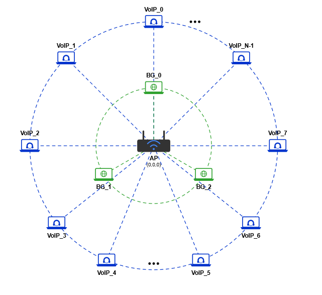

# VoIP QoS Analysis — 802.11ac / 802.11ax / 802.11be

Comparative ns-3 simulation study evaluating VoIP quality of service across three Wi-Fi generations under congestion. Priority UDP traffic (G.711) competes with saturating TCP background load across three experimental scenarios.

---

## Repository structure

```
.
├── ac-ax-be-comparison_final.cc   # ns-3 simulation (all 3 scenarios)
├── run_scenario1.sh               # sweep runner — Scenario 1
├── results_scenario1.csv          # raw output from Scenario 1
├── visualize_s1.py                # plots for Scenario 1
└── topology.png                   # network topology diagram
```

---

## Simulation overview

**Topology** — single BSS, one AP, two station groups:



VoIP stations (blue, outer ring) are placed at 10 m from the AP. Background stations (green, inner ring) are placed at 7 m. All positions are static for the duration of the simulation.

**Traffic model**

| Flow | Protocol | Payload | Interval | Rate | EDCA queue |
|------|----------|---------|----------|------|------------|
| VoIP (uplink + downlink) | UDP | 100 B | 20 ms | 40 kbps | AC_VO |
| Background | TCP | 1000 B | — | 2 Mbps | AC_BE |

**Fixed parameters** — 5 GHz band, 80 MHz channel, MCS 7 on all standards, 800 ns guard interval, log-distance propagation (n = 3.0), 10 m AP–STA distance, 30 s simulation time.

**QoS thresholds (ITU-T G.114)**

| Metric | Threshold |
|--------|-----------|
| One-way delay | < 150 ms |
| Jitter | < 30 ms |
| Packet loss | < 1 % |

---

## Scenarios

### Scenario 1 — RTS/CTS collision mitigation
Sweeps the RTS/CTS threshold across three modes to isolate its effect on hidden-node collisions and VoIP QoS.

| `--rtsCtsMode` | RTS threshold | Effect |
|----------------|--------------|--------|
| `off` | 2347 B (disabled) | no handshake overhead |
| `all` | 0 B | RTS/CTS on every frame |
| `tcponly` | 500 B | RTS/CTS only on TCP frames (> 500 B) |

### Scenario 2 — Rate Adaptation Algorithm (RAA)
`--raaVariant=constant|minstrel|ideal` — compares fixed-rate transmission against adaptive algorithms under varying node density.

### Scenario 3 — TCP Congestion Control
`--tcpVariant=newreno|cubic|bbr` — evaluates how the background TCP algorithm affects VoIP QoS as station count increases.

---

## Requirements

- **ns-3** ≥ 3.36 (802.11ac, 802.11ax support)
- **ns-3** ≥ 3.40 required for 802.11be (`--standard=be`)
- Python 3 with `pandas`, `matplotlib`, `numpy` (for visualisation)

---

## Usage

### 1. Build

```bash
cp ac-ax-be-comparison_final.cc <ns3-dir>/scratch/voip-unified.cc
cd <ns3-dir>
./ns3 build
```

### 2. Run a single simulation

```bash
./ns3 run "scratch/voip-unified \
    --scenario=1 \
    --standard=ax \
    --rtsCtsMode=off \
    --nVoip=10 \
    --nBackground=3 \
    --runSeed=1"
```

### 3. Run the full Scenario 1 sweep (135 runs)

```bash
chmod +x run_scenario1.sh
./run_scenario1.sh
# Results written to: results_scenario1.csv
```

### 4. Visualise results

```bash
python3 visualize_s1.py --input results_scenario1.csv
# Output: s1_plots.png
```

---

## Output format

Each simulation run appends one CSV row per flow:

```
scenario, standard, rtsCtsMode, rtsThreshold, raaVariant, tcpVariant,
nVoip, nBg, seed, srcAddr, dstAddr, protocol,
txPkts, rxPkts, lostPkts, lossPct,
meanDelayMs, meanJitterMs, throughputKbps
```

Filter VoIP flows in Python:

```python
import pandas as pd
df = pd.read_csv("results_scenario1.csv")
voip = df[df["protocol"] == "UDP"]
voip.groupby(["standard", "rtsCtsMode"])[["meanDelayMs", "meanJitterMs", "lossPct"]].mean()
```
